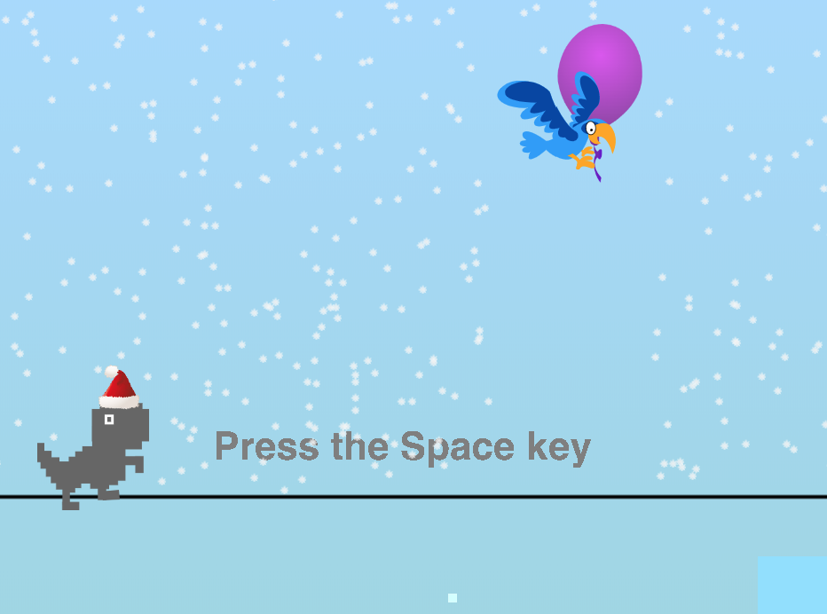
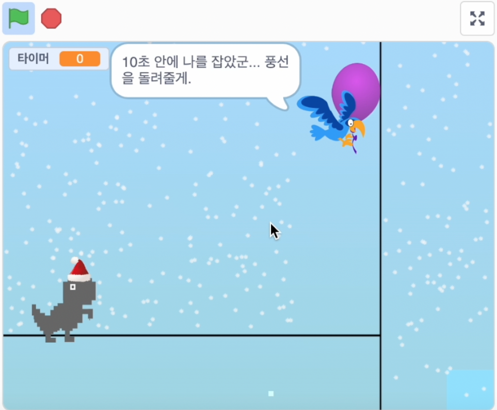
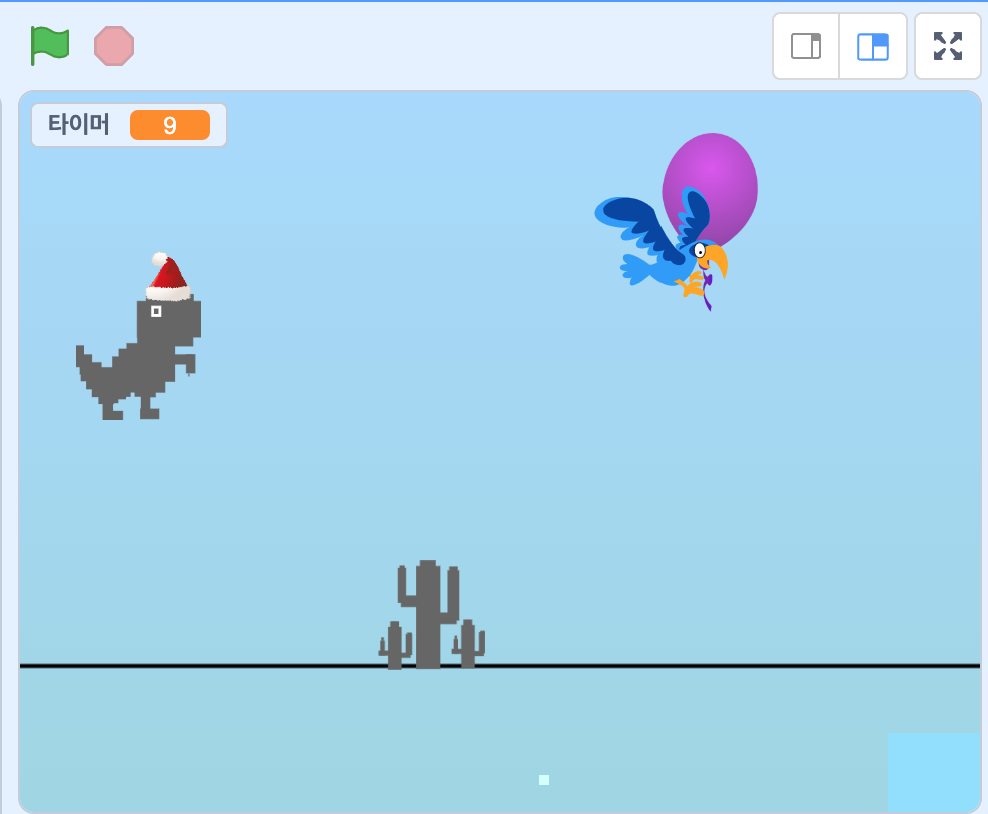
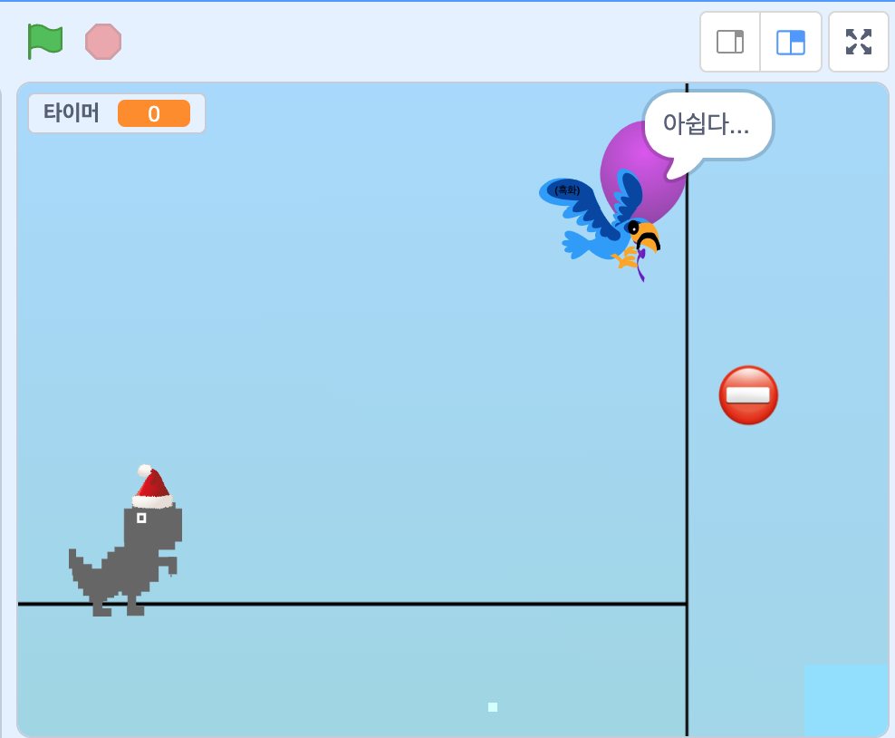
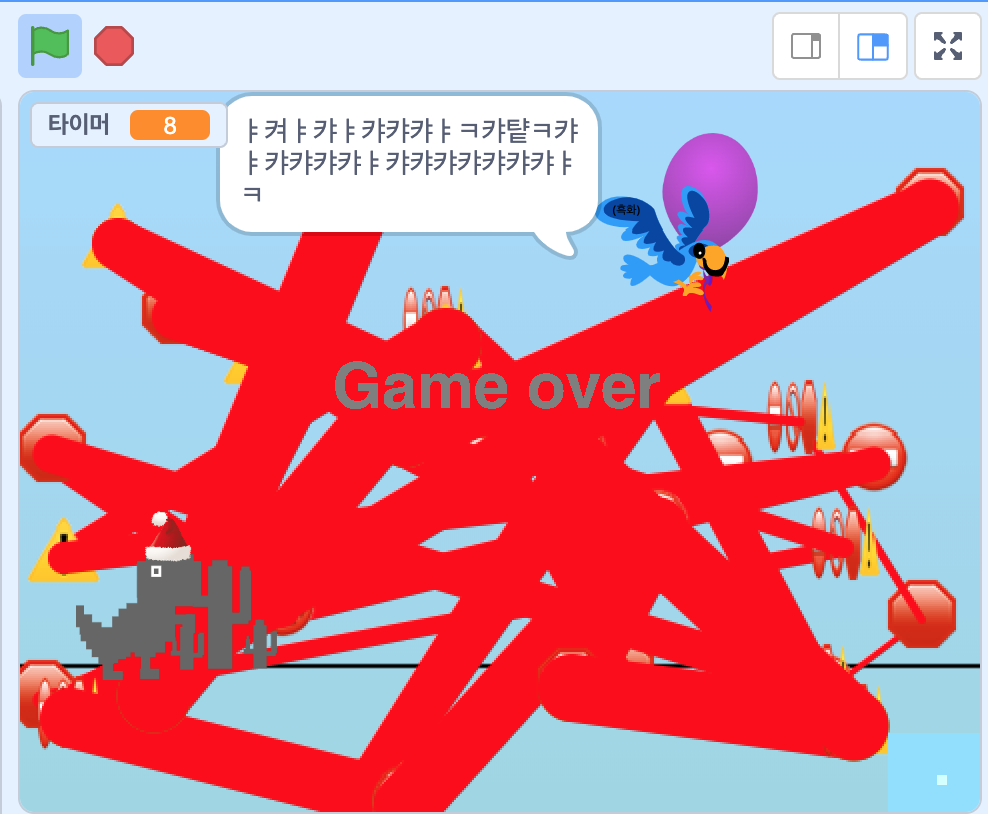

# W7_T-Rex 설명

1. 시작 방법
    - 녹색 깃발을 누른다.

    
    - 'Press the Space key'가 나온후 스페이스키를 누른다.
2. 플레이 방법
    - 게임 종료되는 조건
       - (성공) 장애물을 다 피하고 10초동안 완주하면 게임이 종료된다.
        	 게임에 성공하면 익룡이 ‘10초 안에 나를 잡았군... 풍선을 돌려줄게.’라고 하며 풍선을 공룡에게 돌려줍니다.
        - (실패) 선인장 또는 바위에 닿으면 게임이 종료된다.
    - 조작방법
        - 스페이스키를 눌러서 점프한다
        
        
3. 호러모드
    - 4번키를 눌러서 호러모드가 작동한다.
    - 익룡의 스킨이 바뀐다.
        - (성공) 익룡이 ‘아쉽다’라고 하며 풍선을 공룡에게 돌려줍니다.
        - (실패) 게임에 실패하면 익룡이 ‘ㅑ켜ㅑ캬ㅑ캬캬캬ㅑㅋ캬턑ㅋ캬ㅑ캬캬캬캬ㅑ캬캬캬캬캬캬캬ㅑㅋ’라고 하며 배경이 빨갛게 뒤덮인다.
	 
 